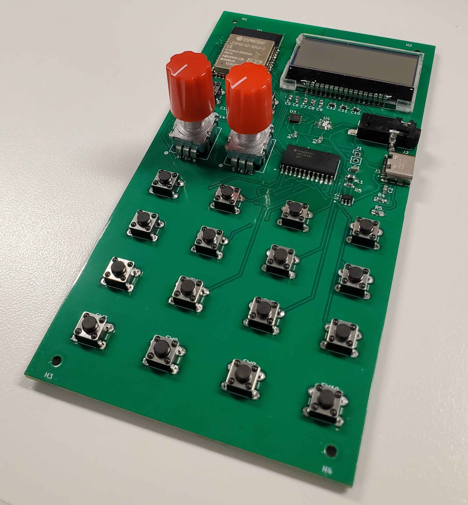
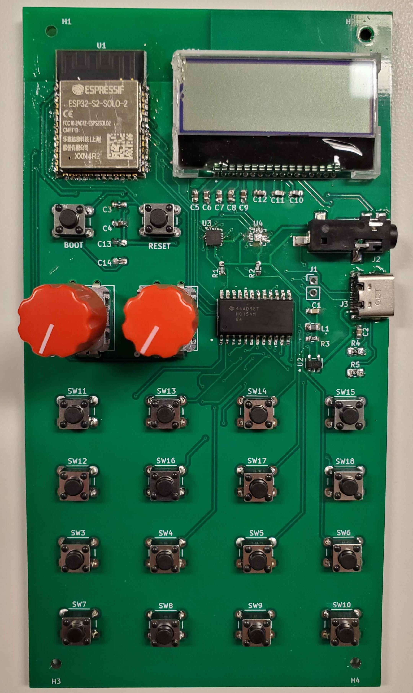
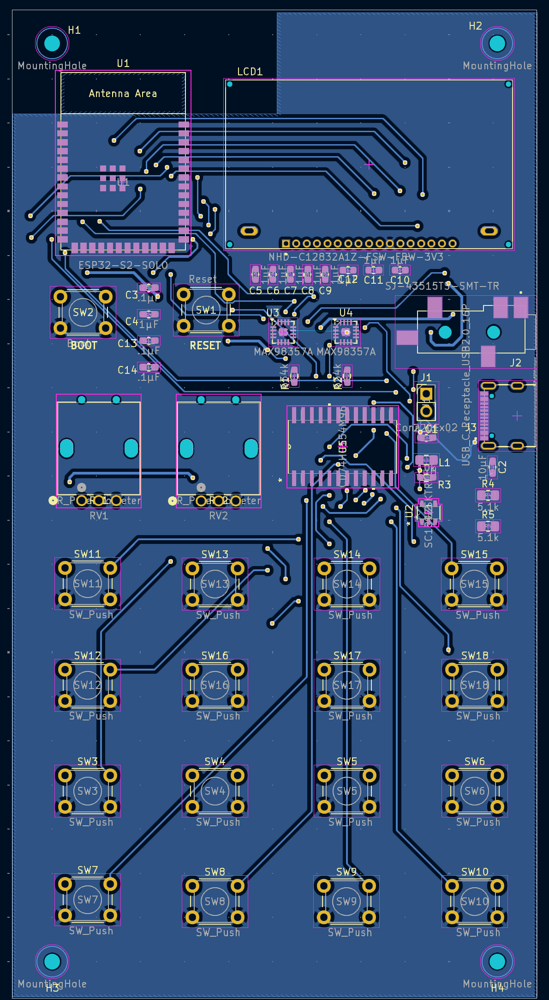
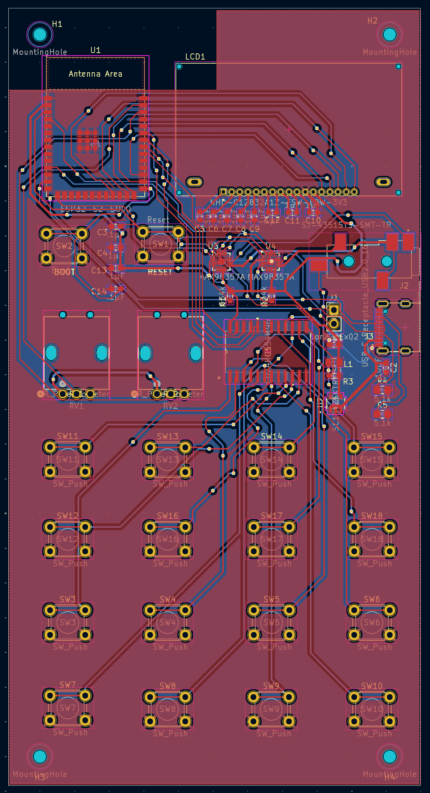

# Pocket Operator

## Contents

- [`device`](device/) - Board design files ([see README](device/README.md))
- [`firmware`](firmware/) - Device firmware ([see README](firmware/README.md))

## Gallery

| Completed Board (bird's eye) | Completed Board (top) |
| --------------- | -------- |
|  |  | 

| Layout (Top) | Layout (Bottom) | Layout (Full) |
| ------------ | --------------- | ------------- |
|  |  |  |

| Schematic |
| --------- |

