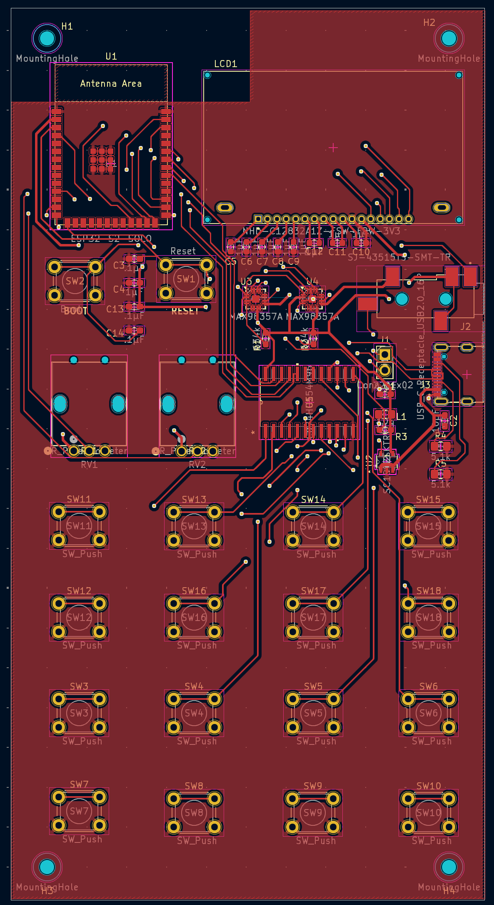

# Pocket Operator

## Contents

- [`firmware`](firmware/) - Firmware (TODO)
- [`device`](device/) - Board design files

## Images

### Board Layout

### Board Schematic

## Contributing

### Firmware

TODO

### Board

#### KiCad Libraries

Must install:

- [Digikey Library](https://www.digikey.com/en/resources/design-tools/kicad) ([GitHub](https://github.com/Digi-Key/digikey-kicad-library))
- [Espressif Library (v3.0.1)](https://github.com/espressif/kicad-libraries/releases/tag/3.0.1)

